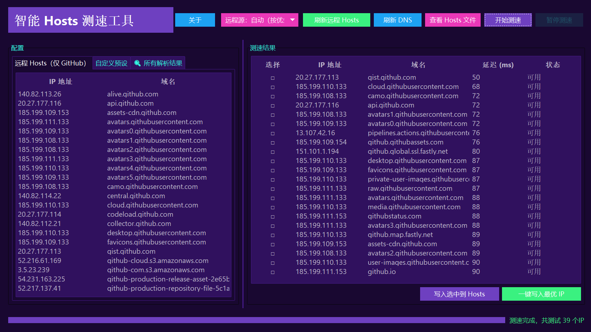

# SmartHostsTool-github
## 智能Hosts测速工具

一款专注于**自动获取域名IP、多节点测速、一键写入最优IP到Hosts文件**的工具，帮你快速解决域名访问慢、无法访问的问题（默认内置GitHub相关域名，也支持自定义添加任意域名）。

## 📌 项目核心信息
| 信息项       | 详情                                                                 |
|--------------|----------------------------------------------------------------------|
| 版本号       | V1.2                                                                 |
| 开发作者     | 毕加索自画像                                                         |
| 核心功能     | 1. 自动拉取远程Hosts数据（默认适配GitHub） 2. 自定义添加待测速域名 3. 多IP节点延迟测速（按延迟排序） 4. 一键写入最优IP到系统Hosts 5. 快速刷新DNS使配置生效 |
| 开源声明     | 该工具完全开源免费！如果你通过付费渠道获取此软件，说明你已遭遇诈骗！ |
| 仓库地址     | https://github.com/KenDvD/SmartHostsTool-github                       |

## 🖼️ 软件界面详解
### 1. 「关于」界面
软件启动后，点击顶部「关于」按钮可打开此界面，包含项目基础信息与初步使用指引：

- 左侧：作者头像与标识
- 右侧「项目信息」区：展示版本、简介、作者、仓库链接
- 下方「软件详细使用说明」区：内置初步操作步骤（可点击「收起使用说明」隐藏）
- 底部按钮：「打开GitHub」可直接跳转至本仓库，「确定」关闭关于界面

### 2. 主操作界面
软件核心功能的操作区域，是日常使用的主要界面：

#### 界面功能分区详解：
1. **顶部操作栏**：
   - 「关于」：打开上述关于界面
   - 「刷新远程Hosts」：拉取最新的GitHub相关域名-IP列表
   - 「刷新DNS」：使新写入的Hosts配置立即生效
   - 「查看Hosts文件」：直接打开系统的Hosts文件（方便手动编辑）
   - 「开始测速」/「暂停测速」：启动/中断当前域名的IP测速

2. **左侧标签页区域**：
   - 「远程Hosts数据（仅GitHub）」：默认展示GitHub相关的待测速域名列表
   - 「自定义预设网址」：可添加、管理你需要测速的其他域名（如Google、Twitter等）

3. **右侧测速结果区域**：
   - 列信息：选择框（用于手动勾选IP）、IP地址、对应域名、延迟（ms，数值越小越快）、状态（是否可用）
   - 排序规则：测速完成后，结果会自动按「延迟」从低到高排序

4. **底部操作按钮**：
   - 「一键写入最优IP」：自动选择延迟最低的IP，写入Hosts文件
   - 「写入选中到Hosts」：将手动勾选的IP写入Hosts文件

## 📋 详细使用教程
### 步骤1：以管理员身份启动软件
由于写入Hosts文件需要系统权限，必须以管理员身份运行：
- Windows系统：右键点击软件可执行文件 → 选择「以管理员身份运行」

### 步骤2：选择/添加测速目标
#### 方式1：使用默认GitHub域名
直接使用「远程Hosts数据（仅GitHub）」标签页的默认列表（包含`github.com`、`assets-cdn.github.com`等常用域名）。

#### 方式2：添加自定义域名
1. 切换到「自定义预设网址」标签页
2. 点击标签页内的「添加预设」按钮（注：按钮位置在标签页区域内，需确保界面完全加载）
3. 在弹出的输入框中，输入你需要测速的域名（如`google.com`、`twitter.com`），点击「确定」
4. 重复操作可添加多个自定义域名

### 步骤3：启动测速
点击顶部操作栏的「开始测速」按钮，软件会自动对当前标签页的所有域名进行多节点IP测速：
- 测速过程中，右侧结果区域会实时更新IP、延迟、状态信息
- 若需要中断测速，点击「暂停测速」按钮即可

### 步骤4：写入最优IP到Hosts
测速完成后（界面底部会提示「测速完成，共测试X个IP」）：
#### 方式1：一键写入最优IP（推荐）
点击底部「一键写入最优IP」按钮，软件会自动选择每个域名延迟最低的IP，写入系统Hosts文件。

#### 方式2：手动选择IP写入
1. 在右侧结果区域，勾选你需要的IP对应的选择框（可勾选多个）
2. 点击底部「写入选中到Hosts」按钮，完成写入

### 步骤5：使配置生效
点击顶部操作栏的「刷新DNS」按钮，让系统立即加载新的Hosts配置，无需重启设备。

## ⚠️ 注意事项
1. **权限必须足够**：务必以管理员身份运行，否则会出现「写入失败」的提示
2. **网络环境影响**：测速结果受当前网络波动影响，若延迟过高可尝试重新测速
3. **Hosts文件备份**：若担心操作失误，可先手动备份系统Hosts文件（路径：Windows系统为`C:\Windows\System32\drivers\etc\hosts`）
4. **开源免费声明**：本工具无任何付费版本，请勿相信第三方付费下载渠道

## ❓ 常见问题
Q：为什么测速后没有结果？
A：可能是网络连接问题，或目标域名无可用IP，可尝试点击「刷新远程Hosts」后重新测速。

Q：写入Hosts后仍然无法访问目标网站？
A：请确认已点击「刷新DNS」，或重启浏览器/网络设备后再尝试。

Q：如何删除自定义添加的域名？
A：在「自定义预设网址」标签页，选中需要删除的域名，点击「删除预设」按钮即可。